# Semantic Indexing Performance Audit Prompt

## Role

Act as a senior performance engineer specializing in local LLM inference, embedding pipelines, source-code indexing, vector databases, GPU acceleration, Java applications, and Windows systems.

You are working inside an existing local LLM harness that supports semantic search over source code. The harness scans a repository, chunks source files, generates embeddings with a local Qwen embedding model, and stores those embeddings in an index.

Your job is to inspect the actual project and determine how to make initial indexing and incremental re-indexing materially faster without reducing search quality, corrupting the index, or making the system unreliable.

Do not guess about the implementation. Trace the real indexing path, inspect configuration and dependencies, measure the current behavior, identify bottlenecks, and propose changes supported by evidence.

---

## Current Environment

Assume the current development machine is approximately:

- Windows 11
- AMD Radeon RX 6700 XT
- 12 GB dedicated VRAM
- 64 GB system RAM
- NVMe storage
- Local Qwen embedding model
- A large source-code repository
- A Java-based or Java-integrated local LLM harness
- GPU utilization reaches approximately 95%
- Dedicated VRAM usage reaches approximately 8 GB
- CPU utilization is much lower than GPU utilization
- Task Manager shows the workload primarily on `Compute 0`; `Compute 1` is mostly idle

Treat these as observations, not conclusions. Verify what matters from logs, runtime configuration, backend selection, and code.

---

# Primary Objective

Reduce total indexing time while preserving or improving:

1. Retrieval quality
2. Index correctness
3. Deterministic incremental updates
4. Stability under large repositories
5. Reasonable memory use
6. Responsiveness of the rest of the application
7. Compatibility with the target hardware and operating system

Focus on throughput measured as:

- Files scanned per second
- Chunks generated per second
- Chunks embedded per second
- Tokens embedded per second
- Embedding batches per second
- Vectors written per second
- End-to-end repository indexing time
- Incremental re-index time after a small code change

---

# Required Investigation Process

## Phase 1: Map the Entire Indexing Pipeline

Trace the complete path from the user starting an index scan to the index becoming searchable.

Document every stage, including:

1. Repository traversal
2. Include and exclude filtering
3. File metadata collection
4. File reading
5. Encoding detection
6. Binary-file detection
7. Language detection
8. Parsing
9. Symbol extraction
10. Chunk generation
11. Chunk normalization
12. Hashing or change detection
13. Tokenization
14. Embedding request creation
15. Model inference
16. Embedding result transfer
17. Vector normalization
18. Metadata serialization
19. Vector database insertion
20. Transaction commits
21. Index finalization
22. Cache writes
23. Progress reporting
24. Logging
25. Cleanup and memory release

For each stage, identify:

- Source files and classes involved
- Thread or executor used
- Whether it is synchronous or asynchronous
- Whether it can overlap with adjacent stages
- Input and output data structures
- Batch sizes
- Queue sizes
- Allocations
- Disk access
- Locking
- Retry behavior
- Timeout behavior
- Logging volume
- Error handling
- Potential duplicate work

Produce a concise pipeline diagram using Mermaid.

Example format:


Replace this example with the actual architecture.

---

## Phase 2: Add Measurement Before Optimization

Before recommending code changes, establish a repeatable benchmark.

Create or improve instrumentation that records elapsed time and throughput for every major stage.

At minimum, capture:

```text
repository_file_count
eligible_file_count
skipped_file_count
total_source_bytes
total_chunks
total_tokens
scan_duration_ms
read_duration_ms
parse_duration_ms
chunk_duration_ms
hash_duration_ms
tokenization_duration_ms
embedding_queue_wait_ms
embedding_inference_duration_ms
embedding_transfer_duration_ms
vector_write_duration_ms
commit_duration_ms
total_index_duration_ms
peak_heap_bytes
peak_native_memory_bytes
peak_vram_bytes
average_cpu_percent
average_gpu_percent
embedding_batch_size
average_actual_batch_size
p50_batch_latency_ms
p95_batch_latency_ms
p99_batch_latency_ms
tokens_per_second
chunks_per_second
vectors_per_second
cache_hit_count
cache_miss_count
reused_embedding_count
failed_batch_count
retried_batch_count
```

Also record configuration that affects reproducibility:

```text
embedding_model
model_quantization
embedding_dimension
backend
device
driver_version
runtime_version
java_version
jvm_arguments
thread_counts
queue_capacities
chunking_strategy
chunk_size
chunk_overlap
vector_store
database_commit_batch_size
repository_revision
```

### Benchmark Scenarios

Create benchmark commands or tests for:

1. Cold full index
2. Warm full index
3. Full index with embedding cache populated
4. Incremental index after editing one small file
5. Incremental index after editing one large file
6. Incremental index after renaming a file
7. Incremental index after deleting a file
8. Indexing a repository with many small files
9. Indexing a repository with fewer large files
10. Re-running an unchanged repository

Run each meaningful scenario at least three times and report median results. Avoid comparing single noisy runs.

---

# Bottleneck Questions to Answer

Answer each question using code inspection and measurements.

## Repository Scanning and File I/O

- Is the entire repository rescanned when only a few files changed?
- Are ignored directories pruned before traversal?
- Are `.gitignore`, project ignore rules, generated folders, dependency folders, build folders, caches, binaries, and vendored code excluded efficiently?
- Are file contents read more than once?
- Are files loaded fully into memory when streaming would be sufficient?
- Are file timestamps trusted incorrectly?
- Is a content hash computed even when size and modification time prove a file is unchanged?
- Is hashing single-threaded?
- Is the chosen hash unnecessarily expensive?
- Are directory walks or file reads serialized?
- Is antivirus or Windows Defender affecting repeated reads?
- Are temporary files written unnecessarily?
- Is the index stored on the same busy disk as the source repository?
- Are there excessive small random writes?

## Parsing and Chunking

- Is every file parsed with a heavyweight parser?
- Can unsupported or low-value files use a cheaper fallback?
- Is parsing repeated between symbol extraction and chunking?
- Is chunking creating excessive tiny chunks?
- Is overlap producing large amounts of duplicate token work?
- Are imports, boilerplate, generated code, minified code, lockfiles, or data files being embedded unnecessarily?
- Are chunks copied repeatedly as strings?
- Are UTF-16 Java strings causing avoidable allocation pressure?
- Can chunk metadata reference source ranges instead of duplicating full text?
- Are AST nodes retained longer than needed?
- Is chunk generation parallelized safely?
- Does chunk ordering need to be globally deterministic, or only deterministic per file?

## Tokenization

- Is tokenization performed once or multiple times for the same chunk?
- Is tokenization on the CPU keeping the GPU fed?
- Is tokenization single-threaded?
- Does the runtime support batched tokenization?
- Are token counts recalculated during truncation, logging, and inference?
- Can token IDs be cached for unchanged chunks?
- Are chunks truncated only after expensive processing?
- Are special-token settings correct?
- Are strings converted between Java, native code, JSON, and byte arrays multiple times?

## Embedding Inference

- Which backend is actually used: Vulkan, DirectML, ONNX Runtime, llama.cpp-compatible runtime, ROCm/HIP, OpenCL, CPU, or another backend?
- Is the model fully offloaded to the GPU?
- Are unsupported operations falling back to the CPU?
- Is the GPU waiting between batches?
- Is the selected batch size optimal?
- Is the configured batch size different from the average actual batch size?
- Are requests submitted one chunk at a time?
- Are batches grouped by similar token length to reduce padding?
- Is dynamic batching available?
- Is batch assembly too slow?
- Are there synchronization barriers after every request?
- Are results copied GPU-to-CPU more often than necessary?
- Is embedding normalization performed inefficiently?
- Is model inference invoked through a local HTTP process, subprocess, JNI, or in-process library?
- If HTTP is used, is a persistent connection used?
- If subprocesses are used, is a process started per batch?
- Is JSON serialization a meaningful percentage of total time?
- Can binary or shared-memory transport be used?
- Is the model context configured much larger than necessary?
- Is the embedding dimension larger than retrieval quality requires?
- Would another quantization improve throughput without unacceptable quality loss?
- Would a smaller embedding model provide adequate code retrieval quality?
- Does the backend expose separate transfer and compute queues?
- Can data transfer overlap with inference?
- Would multiple inference workers help, or would they only contend for the same GPU?
- Is GPU utilization high because inference is efficient, or because a kernel is stalled on memory bandwidth?
- Is VRAM headroom sufficient for larger batches?
- Are out-of-memory safeguards reducing batches dynamically?
- Is the GPU power-limited, temperature-limited, or clock-limited?
- Are GPU clocks stable during the run?

Do not assume that the idle `Compute 1` graph represents unused compute capacity. Determine whether the backend can use asynchronous queues and whether another queue would improve overlap rather than merely compete for the same compute units.

## Pipeline Concurrency

Determine whether the current system resembles this inefficient pattern:

```text
scan all files
then parse all files
then chunk all files
then tokenize all chunks
then embed all chunks
then write all vectors
```

Evaluate replacing it with a bounded streaming pipeline:

```text
scanner -> reader/parser workers -> chunk queue -> tokenizer workers
        -> dynamic batcher -> embedding worker -> vector writer
```

The proposed pipeline must include:

- Bounded queues
- Backpressure
- Cancellation
- Failure propagation
- Retry limits
- Deterministic IDs
- Graceful shutdown
- Progress reporting
- Memory limits
- Metrics for queue wait time and queue depth

Identify the ideal concurrency separately for:

- Directory scanning
- File reads
- Parsing
- Chunking
- Tokenization
- Embedding
- Vector writes

Do not use one global thread count for all stages unless measurements justify it.

## Vector Storage

- Are vectors inserted one at a time?
- Are transactions committed too frequently?
- Are indexes rebuilt after every insertion?
- Can writes be batched?
- Can the vector index be built in bulk?
- Is metadata stored redundantly?
- Is the database using synchronous durability settings that are excessive for a rebuildable local cache?
- Can write-ahead logging settings be adjusted safely?
- Are embeddings serialized to text instead of a compact binary form?
- Are float32 vectors required, or can float16 or quantized storage be used?
- Is cosine normalization duplicated at query time and index time?
- Are database locks serializing unrelated work?
- Is progress reporting executed inside the write transaction?
- Can index finalization be deferred until all vectors are loaded?

## Incremental Indexing and Caching

Design or validate a content-addressed incremental system.

At minimum, evaluate stable identifiers based on:

```text
repository_id
relative_path
language
chunk_strategy_version
chunk_content_hash
embedding_model_id
embedding_model_revision
embedding_dimension
normalization_mode
```

The system should be able to:

- Skip unchanged files
- Reuse unchanged chunks from modified files
- Reuse embeddings when code moves between files
- Delete stale vectors
- Detect renames
- Invalidate only when chunking or model behavior changes
- Resume interrupted indexing
- Avoid re-embedding after application restarts
- Separate the source-file cache from the embedding cache
- Version cache records explicitly
- Verify cache integrity

Determine whether chunks should be hashed before or after whitespace normalization. Explain the retrieval-quality and cache-hit implications.

## Progress Reporting and Logging

- Is the UI updated for every file or chunk?
- Are progress events crossing thread boundaries too frequently?
- Are logs flushed synchronously?
- Is debug logging enabled during indexing?
- Are large prompts, chunks, vectors, or JSON payloads logged?
- Can progress updates be coalesced to 5–10 updates per second?
- Can detailed metrics remain available without adding material overhead?

## Java and JVM Concerns

Inspect for:

- Excessive temporary strings
- Repeated `substring`, concatenation, regex, or stream operations
- Boxing of floats or token IDs
- `List<Float>` instead of primitive arrays
- Large object churn
- Unbounded executor queues
- Blocking calls inside `CompletableFuture`
- Common pool misuse
- Lock contention
- Synchronized hot paths
- Repeated object mapping
- JSON serialization overhead
- Direct-buffer leaks
- JNI boundary overhead
- Garbage collection pauses
- Heap sizing problems
- Native-memory growth
- File descriptor leaks
- Thread oversubscription

Recommend JVM arguments only after examining the Java version, allocation profile, heap size, and GC logs. Do not blindly prescribe a garbage collector.

---

# Experiments to Perform

Implement a benchmark matrix that changes one variable at a time.

## Batch Size Sweep

Test a range appropriate to the runtime, such as:

```text
1, 2, 4, 8, 16, 32, 64, 128
```

Stop before unsafe VRAM pressure. For each value, record:

- Actual batch size
- Tokens per batch
- Batch latency
- Tokens per second
- Chunks per second
- VRAM
- GPU utilization
- CPU utilization
- Failure rate
- End-to-end indexing time

Do not select the batch with the highest GPU utilization. Select the batch with the best stable end-to-end throughput.

## Token-Length Bucketing

Compare:

1. Original chunk order
2. Batches grouped by approximate token length
3. Dynamic batching with a maximum token budget

Measure padding waste:

```text
padding_ratio =
    padded_tokens_processed / actual_tokens_processed
```

## Pipeline Depth

Test bounded queue capacities and determine whether the embedding worker ever starves.

Record:

- Average queue depth
- Maximum queue depth
- Producer blocked time
- Consumer idle time
- Memory usage
- Cancellation latency

## Parser Concurrency

Sweep parser-worker counts without changing embedding concurrency.

Look for:

- Throughput gains
- Allocation growth
- GC pressure
- Disk contention
- Oversubscription
- Reduced GPU starvation

## Embedding Worker Count

Test one and, only if supported, multiple concurrent embedding submissions.

Explain whether multiple workers:

- Increase throughput
- Hide transfer or request latency
- Cause GPU contention
- Increase VRAM use
- Increase tail latency
- Reduce stability

## Vector Write Batch Size

Sweep vector insertion and commit batch sizes.

Measure both ingestion speed and time until the index is query-ready.

## Chunking Strategy

Compare current settings against a small number of alternatives.

Measure:

- Total chunks
- Total tokens
- Duplicate-token percentage caused by overlap
- Indexing time
- Index size
- Retrieval quality on a fixed evaluation set

Do not optimize speed by silently reducing retrieval quality.

## Backend Comparison

Only where the project supports it, compare available backends using the same:

- Model
- Quantization
- Input chunks
- Batch policy
- Embedding normalization
- Hardware
- Evaluation queries

Report both speed and retrieval equivalence.

---

# Retrieval-Quality Guardrail

Create a small, reproducible code-search evaluation set before changing chunking, model, dimension, or normalization.

Include at least 20–50 representative queries such as:

- Find the login request handler
- Where is the vector database initialized?
- Locate retry logic for embedding failures
- Find the code that excludes generated directories
- Where is chunk overlap configured?
- Find all implementations of a named interface
- Locate the method that deletes stale vectors
- Find the configuration controlling model batch size
- Locate error handling for malformed source files
- Find the code responsible for progress updates

For each query, define expected files, symbols, or source ranges.

Track:

- Recall@1
- Recall@5
- Recall@10
- Mean reciprocal rank
- Relevant-file recall
- Relevant-symbol recall
- Query latency
- Index size

Any proposed optimization that changes model, chunking, dimensions, normalization, or stored precision must report its effect on these metrics.

---

# Likely Optimization Categories

Investigate these categories, but do not claim they are applicable until verified.

## Low-Risk Candidates

- Exclude irrelevant directories earlier
- Avoid duplicate file reads
- Skip unchanged files
- Cache embeddings by chunk content hash
- Batch vector writes
- Reduce transaction frequency
- Coalesce progress events
- Disable verbose hot-path logging
- Parallelize parsing with a bounded executor
- Stream stages instead of materializing the full repository
- Reuse buffers and primitive arrays
- Keep the embedding model loaded
- Reuse persistent local connections
- Batch embedding requests
- Increase batch size within measured VRAM limits
- Bucket chunks by token length
- Remove redundant token counting
- Add resume support

## Medium-Risk Candidates

- Change chunk size or overlap
- Change parser strategy
- Use adaptive chunking by language or symbol size
- Store vectors in float16
- Adjust durability settings for a rebuildable index
- Use a different GPU backend
- Use dynamic batching
- Introduce multiple asynchronous GPU submissions
- Move tokenization to a different runtime
- Replace JSON transport with binary transport

## High-Risk Candidates

- Change embedding model
- Reduce embedding dimensions
- Use aggressive vector quantization
- Disable durability without recovery logic
- Run multiple model instances on the same GPU
- Introduce backend-specific native code
- Trust timestamps without content validation
- Remove overlap without retrieval testing

Label every recommendation by risk.

---

# Required Deliverables

Create the following documents or sections.

## 1. Current Architecture

Include:

- Actual end-to-end pipeline
- Relevant classes and files
- Threading model
- Data flow
- Model runtime and backend
- Vector-store behavior
- Cache behavior
- Main bottleneck hypothesis

## 2. Baseline Benchmark

Provide a table:

| Metric | Cold Full Index | Warm Full Index | One-File Incremental |
|---|---:|---:|---:|
| Files | | | |
| Chunks | | | |
| Tokens | | | |
| Total time | | | |
| Tokens/sec | | | |
| Chunks/sec | | | |
| Peak heap | | | |
| Peak VRAM | | | |
| Avg GPU | | | |
| Avg CPU | | | |

## 3. Bottleneck Breakdown

Provide a table:

| Stage | Time | Percent of Total | Parallelism | Main Constraint | Evidence |
|---|---:|---:|---:|---|---|
| Scan | | | | | |
| Read | | | | | |
| Parse/chunk | | | | | |
| Tokenize | | | | | |
| Embed | | | | | |
| Vector write | | | | | |

## 4. Ranked Recommendations

For each recommendation provide:

```text
Title
Problem
Evidence
Proposed change
Files/classes affected
Expected benefit
Risk
Implementation effort
Measurement plan
Rollback plan
Retrieval-quality impact
```

Rank using:

```text
priority_score =
    expected_time_saved
    * confidence
    * frequency_of_benefit
    / implementation_cost
```

A qualitative High/Medium/Low score is acceptable if numeric estimates are unavailable.

## 5. Quick Wins

Identify changes that:

- Require less than roughly half a day
- Have low correctness risk
- Are easy to benchmark
- Are easy to revert

## 6. Structural Improvements

Describe larger architectural changes separately from quick wins.

## 7. Experiment Plan

Provide exact benchmark steps, configuration values, and acceptance criteria.

## 8. Implementation Plan

Create ordered tasks small enough for an AI coding agent to execute safely.

Each task must include:

- Objective
- Files to inspect
- Files likely to modify
- Tests to add
- Metrics to compare
- Completion criteria
- Dependencies
- Risks

## 9. Final Recommendation

State:

- The measured primary bottleneck
- The first three changes to implement
- Expected realistic improvement range
- What not to change yet
- What additional profiling would reduce uncertainty

---

# Implementation Constraints

- Do not rewrite the entire indexing system at once.
- Do not alter retrieval semantics without tests.
- Do not remove error handling to improve benchmark results.
- Do not use unbounded queues.
- Do not introduce unlimited concurrency.
- Do not load the full repository and every chunk into memory unless measurements justify it.
- Do not assume more threads means more throughput.
- Do not assume a second GPU compute graph means unused physical GPU cores.
- Do not optimize only model inference while ignoring file scanning, tokenization, serialization, and database writes.
- Do not use GPU utilization alone as the success metric.
- Do not recommend hardware purchases until software bottlenecks are measured.
- Preserve cancellation and progress reporting.
- Preserve deterministic index contents for identical inputs and configuration.
- Make every cache entry versioned and invalidatable.
- Add tests before changing persistence or incremental-update behavior.

---

# Preferred Profiling Tools

Use tools already present in the project when possible. Depending on the implementation, consider:

- Java Flight Recorder
- Java Mission Control
- Async-profiler
- JVM GC logs
- VisualVM
- Windows Performance Recorder
- Windows Performance Analyzer
- Process Explorer
- GPUView
- AMD Radeon GPU Profiler, if compatible with the backend
- Backend-specific timing logs
- ONNX Runtime profiling, if applicable
- Vulkan validation or profiling tools, if applicable
- Database query and transaction timing
- Custom stage timers and counters

Do not add several profilers at once. Start with low-overhead application metrics, then use a profiler to answer specific unresolved questions.

---

# Suggested Target Architecture

Use this only as a design candidate after mapping the current system.

```mermaid
flowchart LR
    A[Repository Walker] --> B[Change Detector]
    B --> C[Bounded File Queue]
    C --> D[Parser and Chunk Workers]
    D --> E[Content Hash and Cache Lookup]
    E -->|Cache hit| J[Vector Write Buffer]
    E -->|Cache miss| F[Tokenization Workers]
    F --> G[Length-Aware Dynamic Batcher]
    G --> H[Single Persistent Embedding Runtime]
    H --> I[Normalize and Cache]
    I --> J
    J --> K[Bulk Vector Writer]
    K --> L[Atomic Finalization]
```



Important properties:

- The model stays loaded.
- CPU stages prepare work while the GPU embeds the previous batch.
- Queues are bounded.
- Embedding work uses token-budget batching.
- Unchanged chunks reuse cached embeddings.
- Database writes occur in batches.
- Progress updates are rate-limited.
- Cancellation propagates across every stage.
- Index finalization is atomic or recoverable.

---

# Acceptance Criteria

The audit is complete only when it produces:

1. A measured baseline
2. A stage-by-stage timing breakdown
3. Evidence identifying the dominant bottleneck
4. At least three low-risk optimization candidates
5. A benchmark plan for each candidate
6. Retrieval-quality guardrails
7. A safe incremental implementation sequence
8. Clear rollback steps
9. No unsupported claims about GPU queues or concurrency
10. A final recommendation grounded in actual project data

A successful optimization should ideally achieve one or more of the following without meaningful retrieval regression:

- At least 20% faster cold full indexing
- At least 50% faster warm indexing
- Near-instant no-change re-indexing
- Re-indexing only affected chunks after a small edit
- Higher tokens per second at equal stability
- Lower memory use at equal throughput
- Faster vector ingestion
- Reduced time between scan completion and searchable index availability

---

# Initial Instructions to the Coding Agent

Begin with these steps:

1. Locate the command, service, or UI action that starts indexing.
2. Trace the complete call graph into scanning, chunking, embedding, and vector storage.
3. Identify the embedding runtime, backend, model configuration, and request transport.
4. Identify existing metrics, logs, caches, and incremental-index logic.
5. Add a minimal benchmark mode if none exists.
6. Run a baseline without changing behavior.
7. Produce the architecture and bottleneck report.
8. Stop and present findings before making major architectural changes.
9. Implement only the highest-confidence quick win first.
10. Re-run the same benchmark and report the measured difference.

Do not begin by changing batch sizes, thread counts, chunk sizes, or model settings before the baseline exists.
